# Práctica #2 — Topología #1: VPN Site-to-Site con FortiGate

> **Video de demostración:** [🎥 Ver video](PENDIENTE-URL-DEL-VIDEO)

**Asignatura:** Seguridad de Redes  
**Estudiante:** Luis Ariel Alevante Agramonte  
**Matrícula:** 2025-2174  

---

## 1. Objetivo

Implementar una infraestructura en GNS3 en la que una red de usuarios se comunique con un servidor HTTPS remoto exclusivamente a través de una **VPN IPsec Site-to-Site** entre dos FortiGate.

La práctica demuestra que:

- La red de usuarios opera en **VLAN 10** y obtiene direccionamiento mediante **DHCP**.
- El servidor se encuentra en una subred **/28** detrás del segundo FortiGate.
- Los dos FortiGate se comunican mediante direcciones WAN asociadas al identificador **2174**.
- El router ISP proporciona tránsito entre ambas WAN y salida a Internet mediante NAT.
- El servidor responde por **HTTPS** cuando la VPN está activa.
- Al deshabilitar el túnel, la comunicación entre usuario y servidor deja de funcionar.
- Al habilitar nuevamente la VPN, la conectividad se restaura.

---

## 2. Topología

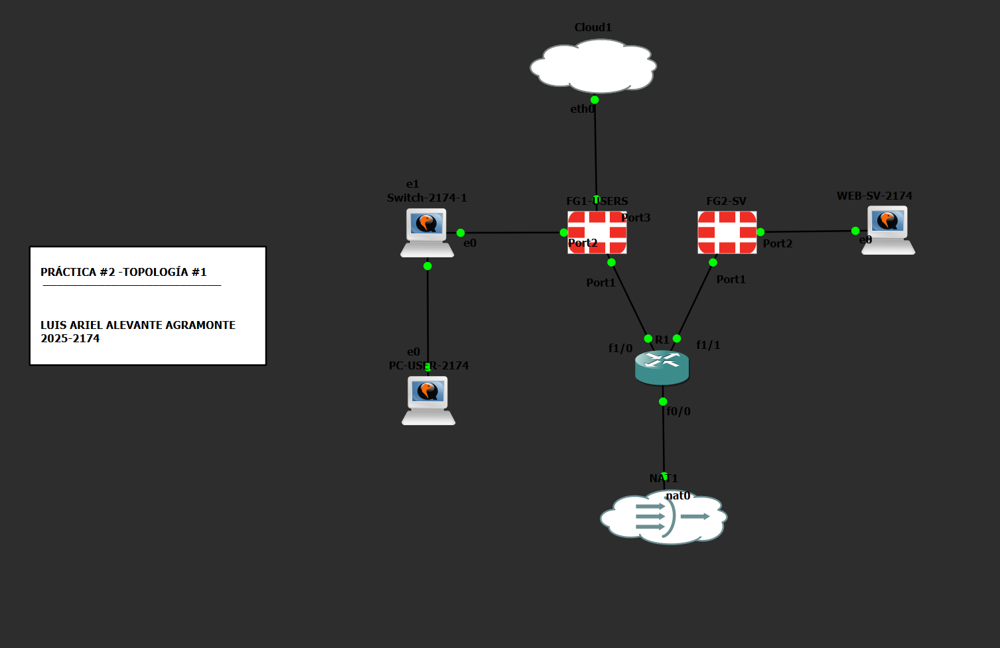

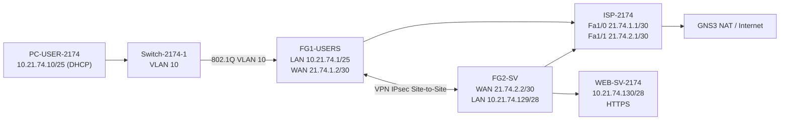

---

## 3. Plan de direccionamiento

| Equipo | Interfaz / función | Dirección |
|---|---|---|
| ISP-2174 | Fa1/0 hacia FG1 | `21.74.1.1/30` |
| FG1-USERS | WAN-ISP / port1 | `21.74.1.2/30` |
| FG1-USERS | VLAN10-USERS | `10.21.74.1/25` |
| PC-USER-2174 | VLAN 10 / DHCP | `10.21.74.10/25` |
| ISP-2174 | Fa1/1 hacia FG2 | `21.74.2.1/30` |
| FG2-SV | WAN-ISP / port1 | `21.74.2.2/30` |
| FG2-SV | LAN-SV / port2 | `10.21.74.129/28` |
| WEB-SV-2174 | ens3 | `10.21.74.130/28` |

Más detalle: [`docs/direccionamiento.md`](docs/direccionamiento.md)

---

## 4. Componentes del entorno

- **GNS3**
- **GNS3 VM sobre VMware**
- **2 × FortiGate VM64-KVM 7.0.9**
- **Cisco C7200** como ISP
- **Cisco IOSvL2** como switch
- **Ubuntu Server** para el usuario
- **Ubuntu Server** para el servidor web
- **GNS3 NAT** para salida temporal a Internet

---

## 5. Configuración implementada

### 5.1 ISP y NAT

El router `ISP-2174` interconecta las WAN de ambos FortiGate.

- `Fa1/0` → `21.74.1.1/30`
- `Fa1/1` → `21.74.2.1/30`
- `Fa0/0` → dirección por DHCP desde GNS3 NAT
- `Fa1/0` y `Fa1/1` configuradas como `ip nat inside`
- `Fa0/0` configurada como `ip nat outside`
- PAT mediante la dirección de `Fa0/0`

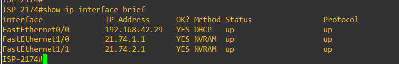

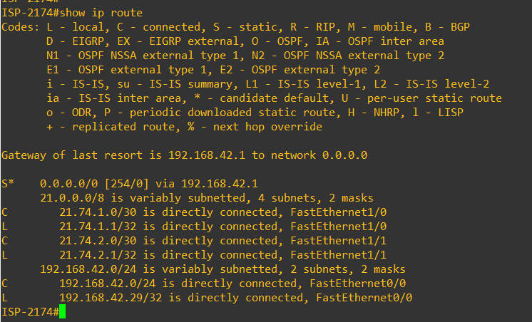

### 5.2 VLAN 10 y trunk

El usuario pertenece a la **VLAN 10**.

- `Gi0/0`: trunk 802.1Q hacia FG1.
- VLAN permitida: `10`.
- `Gi0/1`: puerto access VLAN 10 hacia `PC-USER-2174`.

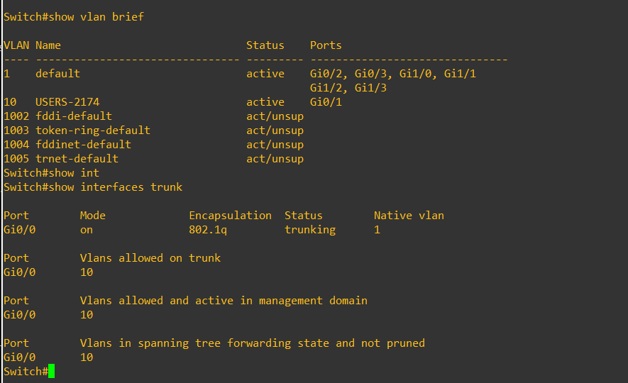

### 5.3 FG1-USERS

El primer FortiGate funciona como gateway de la red de usuarios.

**WAN**
- IP: `21.74.1.2/30`
- Gateway: `21.74.1.1`

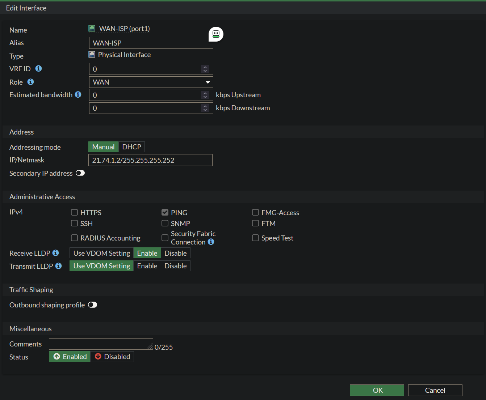

**VLAN 10 / DHCP**
- Gateway LAN: `10.21.74.1/25`
- Pool DHCP: `10.21.74.10 - 10.21.74.100`

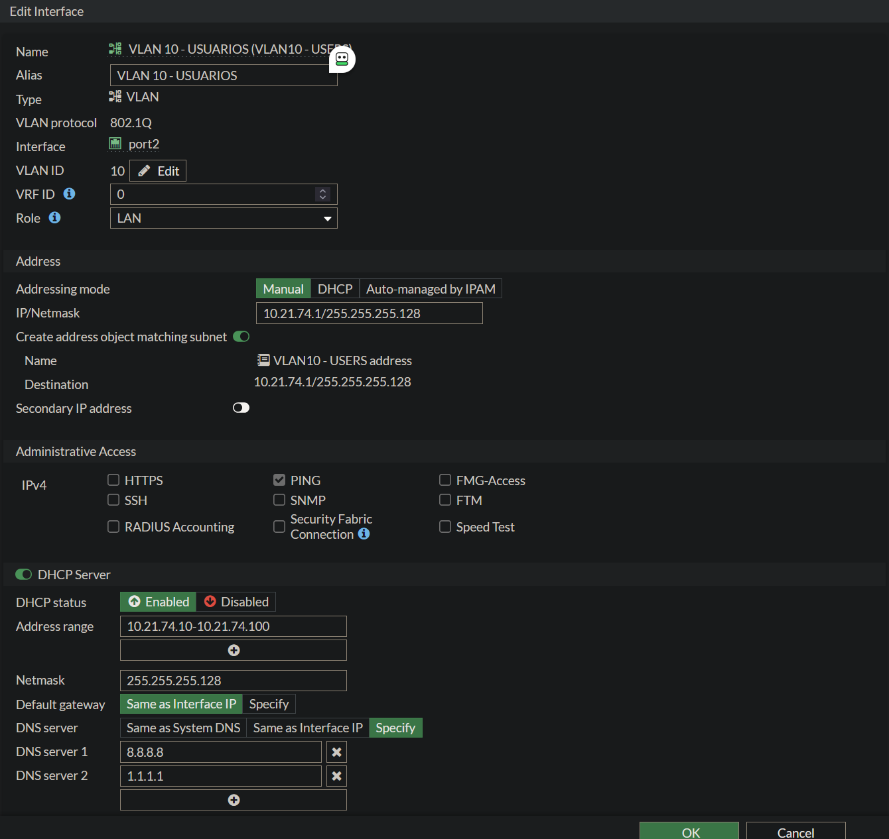

**Política de salida**
- VLAN10 → WAN
- Acción: ACCEPT
- NAT habilitado

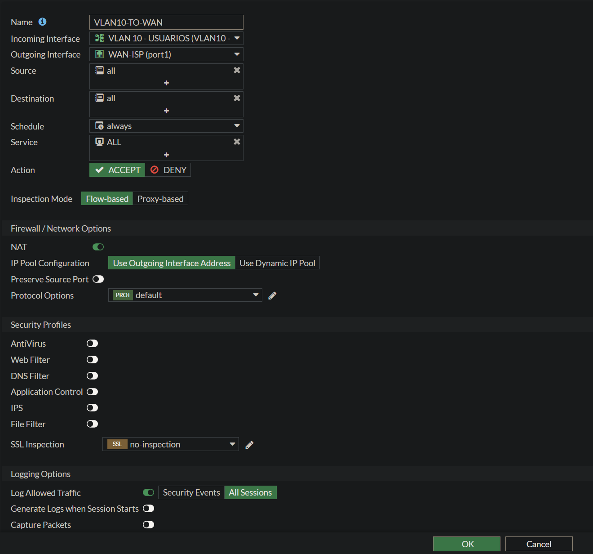

### 5.4 VPN IPsec Site-to-Site

El túnel conecta:

- **Red local FG1:** `10.21.74.0/25`
- **Red remota FG1:** `10.21.74.128/28`
- **Peer de FG1:** `21.74.2.2`

En FG2 los selectores se invierten:

- **Red local FG2:** `10.21.74.128/28`
- **Red remota FG2:** `10.21.74.0/25`
- **Peer de FG2:** `21.74.1.2`

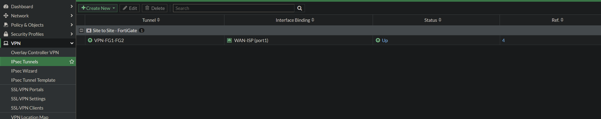

### 5.5 Usuario

El equipo de usuario obtiene su dirección mediante DHCP y utiliza `10.21.74.1` como gateway.

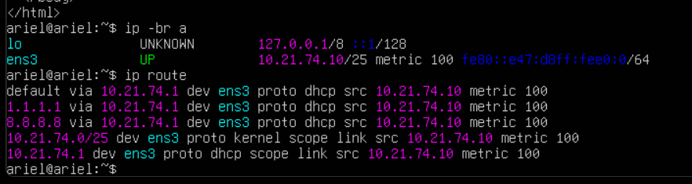

### 5.6 FG2-SV

**WAN**
- IP: `21.74.2.2/30`
- Gateway: `21.74.2.1`

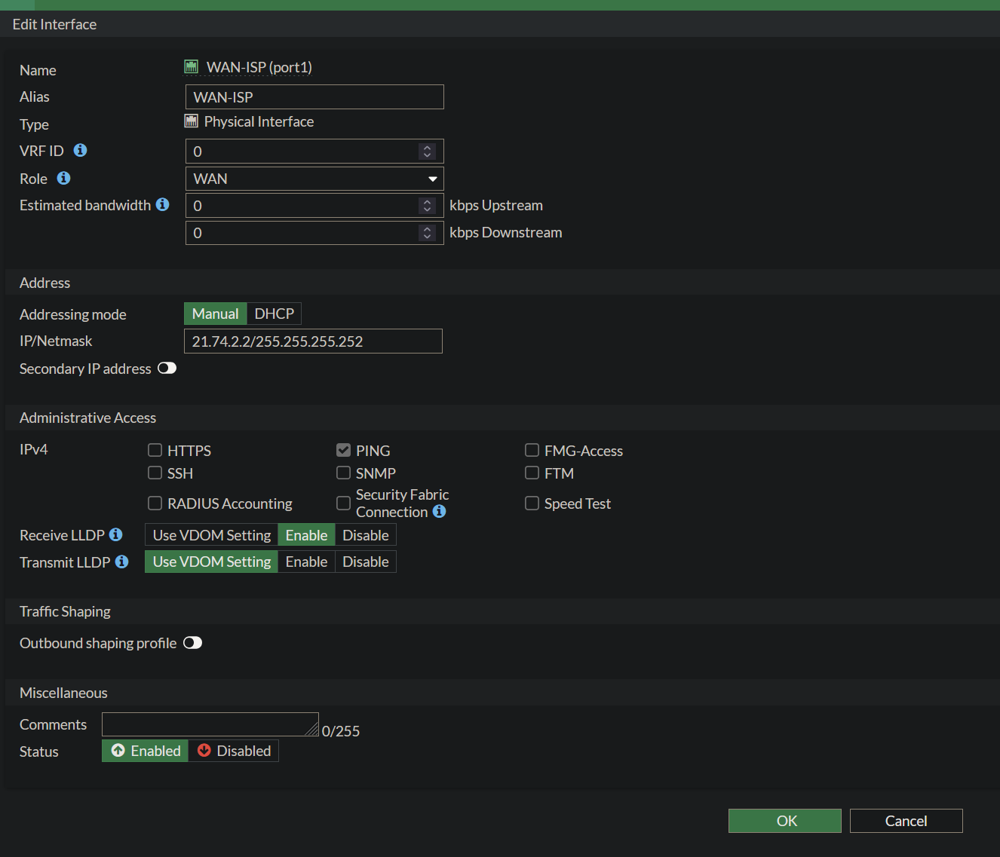

**LAN del servidor**
- Gateway: `10.21.74.129/28`

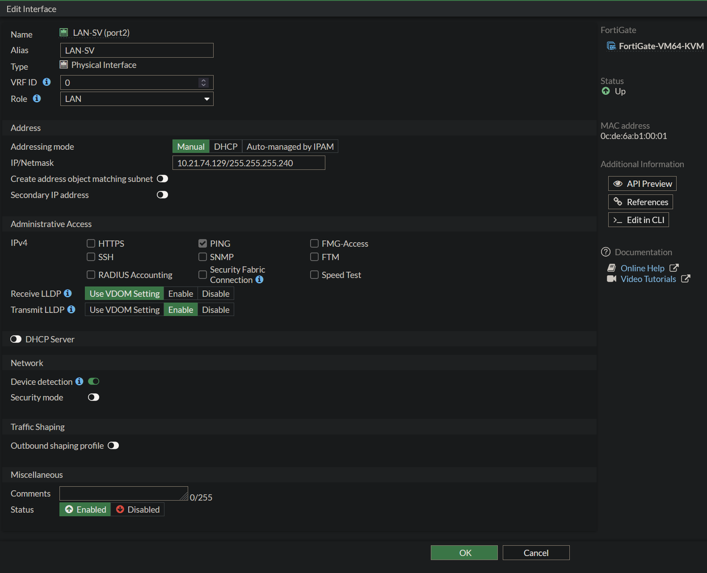

**Política de salida**
- LAN-SV → WAN
- Acción: ACCEPT
- NAT habilitado

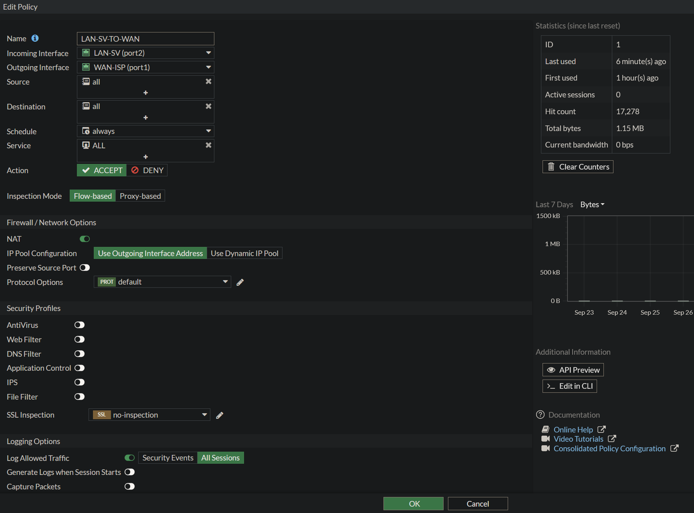

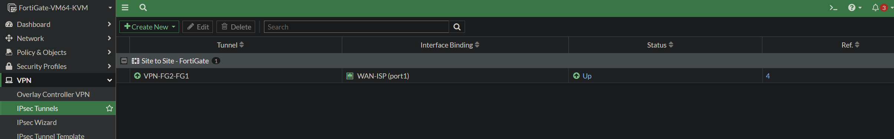

### 5.7 Servidor HTTPS

El servidor Ubuntu utiliza:

- IP: `10.21.74.130/28`
- Gateway: `10.21.74.129`
- Servicio: Apache2 sobre HTTPS/443

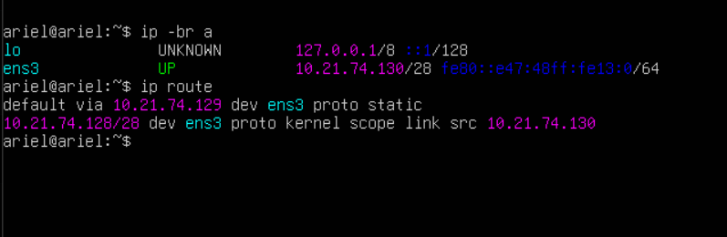

---

## 6. Validación

### 6.1 HTTPS a través de la VPN

La prueba desde `PC-USER-2174` devuelve **HTTP 200**.

```bash
curl -k -s -o /dev/null -w "HTTPS OK - Codigo HTTP: %{http_code}\n" https://10.21.74.130
```

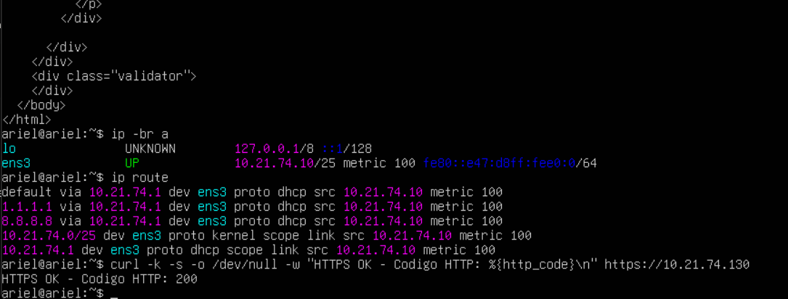

### 6.2 ICMP con VPN activa

```bash
ping -c 4 10.21.74.130
```

Resultado: **0% packet loss**.

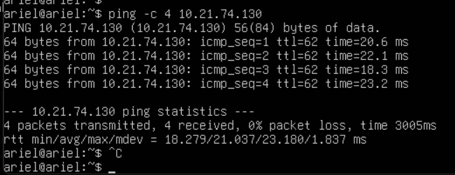

### 6.3 Recorrido hacia el servidor

```bash
tracepath -n 10.21.74.130
```

El recorrido alcanza `10.21.74.130`.

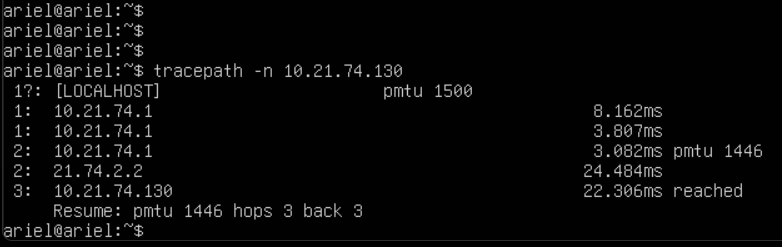

### 6.4 Demostración de dependencia del túnel

Se deshabilita `VPN-FG1-FG2`.

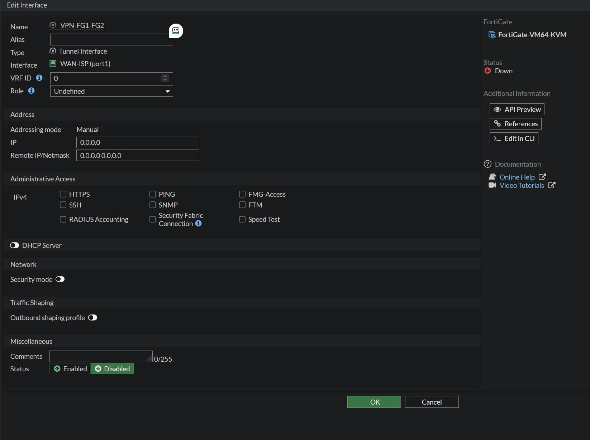

Con el túnel deshabilitado:

- El ping muestra **Destination Net Unreachable**.
- Se obtiene **100% packet loss**.
- La conexión HTTPS al puerto 443 falla.

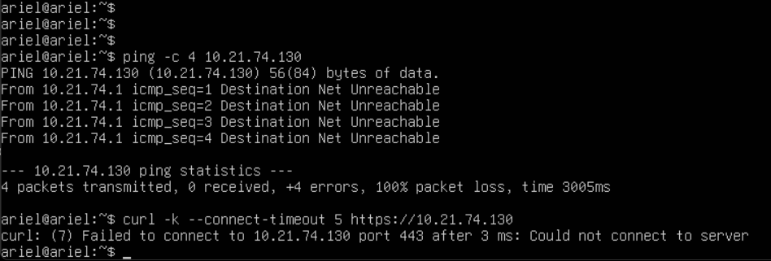

### 6.5 Restauración

Después de habilitar nuevamente la VPN:

- El ping vuelve a responder.
- HTTPS devuelve nuevamente **HTTP 200**.

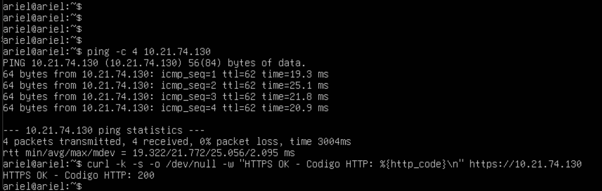

La secuencia completa de validación está documentada en [`docs/validacion.md`](docs/validacion.md).

---

## 7. Running-configs

Las configuraciones están disponibles en [`running-configs/`](running-configs/):

- `ISP-2174-running-config.txt`
- `Switch-2174-running-config.txt`
- `FG1-USERS-running-config-sanitized.conf`
- `FG2-SV-running-config-sanitized.conf`

> **Seguridad:** los backups públicos de FortiGate fueron sanitizados para eliminar contraseñas, PSK y otros secretos. La configuración funcional de interfaces, rutas, políticas y VPN se conserva.

---

## 8. Scripts

La carpeta [`scripts/`](scripts/) contiene scripts de apoyo para reproducir las pruebas y el servidor HTTPS:

- `web-server-https-setup.sh`
- `test-vpn-connectivity.sh`

---

## 9. Resultado

La infraestructura cumple el objetivo principal: el usuario de la VLAN 10 puede alcanzar el servidor HTTPS remoto mediante la VPN IPsec Site-to-Site. La prueba de deshabilitación confirma que la comunicación entre ambas redes depende del túnel VPN, y la habilitación posterior restaura correctamente el servicio.

---

## Estructura del repositorio

```text
SR-PRACTICA-2-INFRAESTRUCTURA-1/
├── README.md
├── docs/
│   ├── direccionamiento.md
│   └── validacion.md
├── evidencias/
│   └── 01 ... 20
├── running-configs/
│   ├── ISP-2174-running-config.txt
│   ├── Switch-2174-running-config.txt
│   ├── FG1-USERS-running-config-sanitized.conf
│   └── FG2-SV-running-config-sanitized.conf
└── scripts/
    ├── README.md
    ├── test-vpn-connectivity.sh
    └── web-server-https-setup.sh
```
